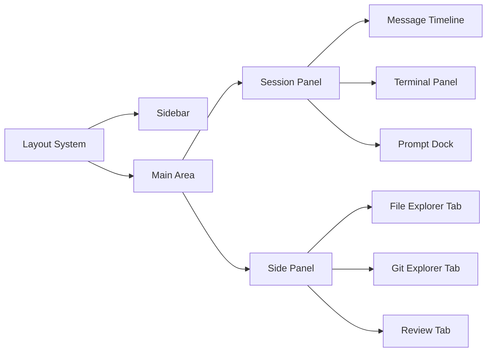

# 设计文档：Desktop Overhaul

## 概述

本设计对 opencode 桌面应用进行全面改版。核心改动集中在 `packages/app`（SolidJS Web UI）和 `packages/ui`（共享组件库）两个包中，`packages/desktop`（Tauri 壳）仅做最小调整。

设计遵循现有架构模式：SolidJS 响应式系统 + Context Provider + 持久化存储（`persisted` 工具）+ Hono HTTP/WebSocket 后端通信。所有新组件复用现有 `@opencode-ai/ui` 组件库和 `@opencode-ai/sdk` API 客户端。

## 架构

### 整体架构不变

```
┌─────────────────────────────────────────────────┐
│                  Tauri Shell                     │
│  (packages/desktop - 最小改动)                    │
├─────────────────────────────────────────────────┤
│              SolidJS Web App                     │
│  (packages/app - 主要改动区域)                    │
│                                                  │
│  ┌──────────┬──────────────────┬──────────────┐ │
│  │ Sidebar  │  Session Panel   │  Side Panel  │ │
│  │          │  ┌────────────┐  │  ┌─────────┐ │ │
│  │ Projects │  │ Messages   │  │  │File Exp │ │ │
│  │ Sessions │  │ Timeline   │  │  │Git Exp  │ │ │
│  │ Search   │  ├────────────┤  │  │Review   │ │ │
│  │          │  │ Terminal   │  │  └─────────┘ │ │
│  │          │  │ Panel      │  │              │ │
│  │          │  ├────────────┤  │              │ │
│  │          │  │ Prompt     │  │              │ │
│  │          │  │ Input      │  │              │ │
│  │          │  └────────────┘  │              │ │
│  └──────────┴──────────────────┴──────────────┘ │
├─────────────────────────────────────────────────┤
│           Shared UI Components                   │
│  (packages/ui - 新增组件)                        │
└─────────────────────────────────────────────────┘
```

### 面板布局系统



布局采用三栏结构：Sidebar（固定宽度 64px 图标栏 + 可展开面板）、Session Panel（弹性宽度）、Side Panel（可调宽度，含 File Explorer / Git Explorer / Review 标签页）。

## 组件与接口

### 1. Layout System 增强

现有 `useLayout` context 已管理 sidebar 状态、面板宽度、文件树开关。扩展方式：

```ts
// packages/app/src/context/layout.ts 扩展
// 新增 Git Explorer 面板状态
// 在现有 fileTree 旁新增 gitExplorer
{
  gitExplorer: {
    opened: Accessor<boolean>
    toggle: () => void
    width: Accessor<number>
    setWidth: (w: number) => void
  }
}
```

面板最小宽度常量：
- Sidebar 展开面板：240px
- Side Panel（File/Git/Review）：280px
- Session Panel 最小宽度：400px
- Terminal Panel 最小高度：120px

### 2. File Explorer 组件

基于现有 `FileTree` 组件（`packages/app/src/components/file-tree.tsx`）扩展。现有组件已实现目录树渲染和异步加载，需增加：

```ts
// packages/app/src/components/file-explorer.tsx
// Props 接口
{
  onFileSelect: (path: string) => void
  onContextMenu: (path: string, event: MouseEvent) => void
  onDragStart: (path: string) => void
  kinds: Map<string, "add" | "del" | "mix">  // Git 变更状态标记
}
```

文件预览复用现有 `Code` 组件（`@opencode-ai/ui/code`），已集成 Shiki 语法高亮。

上下文菜单使用现有 `ContextMenu` 组件（`@opencode-ai/ui/context-menu`），提供：
- 在终端中打开所在目录
- 添加到聊天上下文
- 复制文件路径

### 3. Git Explorer 组件

新增组件，通过 SDK 客户端与后端 Git 操作 API 通信：

```ts
// packages/app/src/components/git-explorer.tsx

// Git 状态数据结构（从 SDK 获取）
type GitStatus = {
  branch: string
  files: Array<{
    path: string
    status: "modified" | "added" | "deleted" | "untracked"
    staged: boolean
  }>
}

// 组件功能：
// - 显示当前分支名 + 分支切换下拉
// - 变更文件列表（分为 staged / unstaged 两组）
// - 暂存/取消暂存操作
// - 提交表单（消息输入 + 提交按钮）
// - 点击文件打开 diff 视图
```

Git 操作通过终端命令执行（复用现有 PTY 基础设施），或通过新增的 SDK API 端点。diff 视图复用现有 `Diff` 组件（`@opencode-ai/ui/diff`）。

### 4. Session Manager 增强

现有会话管理已较完善（创建、归档、删除、重命名、拖拽排序）。增强点：

```ts
// 会话搜索 - 在 sidebar-items.tsx 中新增
// 使用现有 fuzzysort 库进行模糊匹配
import fuzzysort from "fuzzysort"

// 搜索结果高亮
type SearchResult = {
  session: Session
  highlighted: string  // 带 <mark> 标签的高亮标题
}

// 未读徽标 - 复用现有 notification context
// useNotification().session.unseenCount(sessionId)
```

### 5. Terminal Panel 修复

现有终端实现（`packages/app/src/components/terminal.tsx`）的问题修复：

WebSocket 重连机制：
```ts
// 在 terminal.tsx 的 WebSocket 错误/关闭处理中
// 现有代码在 close 事件中仅处理非正常关闭
// 需增加：自动重连逻辑（指数退避）
// 最大重试次数：5
// 初始延迟：1000ms，最大延迟：16000ms
```

错误状态展示：
```ts
// 新增终端错误覆盖层组件
// 当 Ghostty 加载失败或 WebSocket 连接失败时显示
// 提供"重试"按钮
```

### 6. 主题与动画

现有 `ThemeProvider` 已支持明暗模式和自定义主题。增强：

CSS 过渡：
```css
/* 在 packages/app/src/index.css 中 */
/* 面板切换过渡 */
[data-panel] {
  transition: width 150ms ease, opacity 150ms ease;
}

/* 弹窗动画 */
[data-dialog-overlay] {
  animation: fade-in 150ms ease;
}
```

### 7. 组件间通信

利用现有 Context 系统实现面板间协作：

```
Session 产生文件变更
  → sync context 更新 session_diff
  → File Explorer 监听 sync.data.session_diff 自动刷新
  → Git Explorer 监听同一数据源自动更新

File Explorer 右键 → "在终端中打开"
  → 调用 terminal.new() 或复用现有终端
  → 通过 WebSocket 发送 cd 命令

File Explorer 拖拽文件到聊天
  → 调用 prompt.context.add({ type: "file", path })
```

## 数据模型

### Git 状态模型

```ts
type GitFile = {
  path: string
  status: "modified" | "added" | "deleted" | "untracked" | "renamed"
  staged: boolean
}

type GitBranch = {
  name: string
  current: boolean
}

type GitState = {
  branch: string
  branches: GitBranch[]
  staged: GitFile[]
  unstaged: GitFile[]
}
```

### 布局持久化模型

```ts
// 扩展现有 persisted store
type LayoutStore = {
  sidebar: { width: number; opened: boolean }
  sidePanel: { width: number; activeTab: "files" | "git" | "review" }
  terminal: { height: number; opened: boolean }
  fileExplorer: { expandedPaths: string[] }
}
```

### 会话搜索模型

```ts
type SessionSearchState = {
  query: string
  results: Array<{
    session: Session
    score: number
    highlighted: string
  }>
}
```


## 正确性属性

*属性是一种在系统所有有效执行中都应成立的特征或行为——本质上是关于系统应该做什么的形式化陈述。属性是人类可读规范与机器可验证正确性保证之间的桥梁。*

### Property 1: 布局模式由窗口宽度阈值决定

*For any* 窗口宽度值 w，当 w < 768 时布局模式应为 "mobile"，当 w >= 768 时布局模式应为 "desktop"。

**Validates: Requirements 1.1, 1.2**

### Property 2: 面板宽度持久化往返一致

*For any* 有效的面板宽度值，将其写入持久化存储后再读取，应得到相同的宽度值。

**Validates: Requirements 1.3**

### Property 3: 面板宽度低于阈值自动折叠

*For any* 面板和任意宽度值 w，当 w 小于该面板的最小阈值时，面板状态应为折叠（collapsed）。

**Validates: Requirements 1.4**

### Property 4: 项目列表完整渲染

*For any* 项目列表，Sidebar 渲染的图标数量应等于项目列表长度。

**Validates: Requirements 2.1**

### Property 5: 项目排序持久化往返一致

*For any* 项目排列顺序，重新排序后持久化再读取，应得到相同的顺序。

**Validates: Requirements 2.4**

### Property 6: 新消息自动滚动到底部

*For any* 消息列表，当新消息被追加时，滚动位置应位于列表底部。

**Validates: Requirements 3.4**

### Property 7: 文件树完整展示目录结构

*For any* 目录结构（包含文件和子目录），File_Explorer 的树节点集合应包含该目录下的所有条目。

**Validates: Requirements 4.1**

### Property 8: 文件扩展名到图标的映射一致性

*For any* 已知文件扩展名，图标映射函数应返回一个有效的图标标识符，且相同扩展名始终返回相同图标。

**Validates: Requirements 4.4**

### Property 9: Git 状态完整展示

*For any* Git 状态数据（包含分支名和变更文件列表），Git_Explorer 渲染的分支名应等于数据中的分支名，渲染的文件数量应等于变更文件总数。

**Validates: Requirements 5.1**

### Property 10: 暂存操作将文件从未暂存移至已暂存

*For any* 未暂存文件，执行暂存操作后，该文件应出现在已暂存列表中且不再出现在未暂存列表中。

**Validates: Requirements 5.3**

### Property 11: 提交操作清空暂存区

*For any* 非空暂存区和有效提交信息，执行提交后暂存区应为空。

**Validates: Requirements 5.4**

### Property 12: 暂存区徽标数量等于已暂存文件数

*For any* Git 状态，暂存区徽标显示的数字应等于已暂存文件列表的长度；当长度为 0 时不显示徽标。

**Validates: Requirements 5.7**

### Property 13: 终端配色跟随主题

*For any* 主题配置，终端的前景色、背景色、光标色应从该主题的颜色令牌中派生。

**Validates: Requirements 6.3**

### Property 14: 终端标签排序持久化

*For any* 终端标签排列顺序，重新排序后持久化再读取，应得到相同的顺序。

**Validates: Requirements 6.4**

### Property 15: 终端面板高度与行列数对应

*For any* 终端面板高度和字体大小，计算出的行数应等于 floor(可用高度 / 行高)，列数应等于 floor(可用宽度 / 字符宽度)。

**Validates: Requirements 6.5**

### Property 16: 终端缓冲区隐藏/恢复往返一致

*For any* 终端缓冲区内容和滚动位置，隐藏面板后再恢复，缓冲区内容和滚动位置应与隐藏前一致。

**Validates: Requirements 6.6**

### Property 17: 会话按时间倒序排列

*For any* 会话列表，排序后每个会话的最后活动时间应大于等于其后一个会话的最后活动时间。

**Validates: Requirements 7.1**

### Property 18: 会话搜索过滤正确性

*For any* 搜索关键词和会话列表，过滤结果中的每个会话标题都应包含该关键词（模糊匹配），且不包含关键词的会话不应出现在结果中。

**Validates: Requirements 7.4**

### Property 19: 未读消息徽标数量一致

*For any* 会话及其未读消息计数，徽标显示的数字应等于该会话的未读消息数；当计数为 0 时不显示徽标。

**Validates: Requirements 7.5**

### Property 20: 文件变更事件触发面板刷新

*For any* 文件变更事件，File_Explorer 和 Git_Explorer 的刷新回调都应被触发。

**Validates: Requirements 8.2, 8.3**

## 错误处理

### 终端连接错误

- WebSocket 连接失败：显示错误覆盖层，包含错误信息和"重试"按钮。使用指数退避重连（初始 1s，最大 16s，最多 5 次）。
- Ghostty WASM 加载失败：显示降级提示，建议用户检查网络或刷新页面。
- PTY 创建失败：在终端标签区域显示错误状态，提供"重新创建"按钮。

### 文件操作错误

- 文件读取失败：在文件预览区域显示错误信息和重试按钮（需求 4.6）。
- 目录加载超时：显示超时提示，保留已加载的节点。
- 文件过大（>5MB）：显示提示信息，建议使用外部编辑器。

### Git 操作错误

- Git 命令执行失败：通过 Toast 通知显示错误详情（需求 5.6）。
- 分支切换冲突：显示冲突文件列表，提示用户先处理未提交变更。
- 提交失败（空暂存区）：禁用提交按钮，显示提示文本。

### 网络错误

- SDK API 请求失败：使用现有的错误处理机制（`showToast`），显示友好的错误信息。
- 服务器断开：复用现有的 `server.healthy()` 状态指示器。

## 测试策略

### 属性测试（Property-Based Testing）

使用 `fast-check` 库进行属性测试，每个属性测试至少运行 100 次迭代。

每个正确性属性对应一个独立的属性测试，测试标注格式：
**Feature: desktop-overhaul, Property {number}: {property_text}**

属性测试重点覆盖：
- 布局计算逻辑（Property 1, 3, 15）
- 数据持久化往返（Property 2, 5, 14, 16）
- 排序与过滤算法（Property 17, 18）
- 状态转换正确性（Property 10, 11）
- 数据映射一致性（Property 4, 8, 9, 12, 19）

### 单元测试

使用 `bun:test` 运行单元测试，重点覆盖：
- 边界情况：空列表、单元素列表、极端宽度值
- 错误条件：文件加载失败、Git 操作失败、WebSocket 断开
- 具体示例：特定主题切换、特定文件扩展名映射

### 集成测试

- 组件间通信：文件变更事件 → 面板刷新
- 拖拽交互：文件拖拽到聊天输入框
- 上下文菜单：右键菜单选项触发正确操作

### 测试配置

```ts
// fast-check 配置
import fc from "fast-check"

// 每个属性测试的默认配置
const defaultConfig = { numRuns: 100 }
```

测试文件放置在对应源文件旁边，遵循现有项目约定（如 `file-tree.test.ts`、`terminal.test.ts`）。
