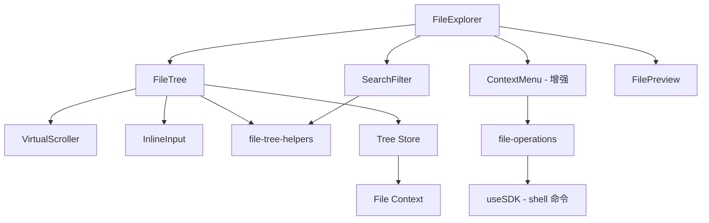

# 设计文档：文件浏览器增强

## 概述

本设计为 opencode 桌面应用的文件浏览器增加三项核心能力：文件树搜索过滤、文件操作（新建/删除/重命名）和虚拟滚动。设计基于现有的 SolidJS + Tauri 2 架构，复用 `useFile()` 上下文和 `useSDK()` 客户端，通过新增辅助函数和组件扩展现有功能。

## 架构



### 关键设计决策

1. **搜索过滤在辅助函数层实现**：过滤逻辑放在 `file-tree-helpers.ts` 中作为纯函数，便于测试。FileExplorer 管理搜索状态，通过 props 传递过滤后的节点列表给 FileTree。

2. **文件操作通过 shell 命令执行**：利用现有 SDK 的 shell 执行能力（`mkdir`、`touch`、`rm`、`mv`），避免引入额外的文件系统 API。操作完成后通过 Tree Store 的 `refresh` 方法刷新目录。

3. **虚拟滚动采用扁平化方案**：将树形结构扁平化为可见节点列表，用固定行高（24px）计算可视区域。节点总数 < 200 时使用普通渲染，≥ 200 时自动切换虚拟滚动。

4. **内联输入复用 Node 样式**：新建和重命名的内联输入框复用现有 Node 组件的布局和缩进逻辑，保持视觉一致性。

## 组件与接口

### SearchFilter 组件

位置：`packages/app/src/components/file-explorer.tsx` 内部

```tsx
// 搜索框嵌入 FileExplorer 的文件树面板顶部
// 状态由 FileExplorer 管理
const [query, setQuery] = createSignal("")
const debouncedQuery = createDebouncedSignal(query, 150)
```

### 过滤辅助函数

位置：`packages/app/src/components/file-tree-helpers.ts`

```ts
// 根据查询文本过滤文件节点列表
// 返回匹配的文件及其所有祖先目录
function filterNodes(input: {
  nodes: FileNode[]
  allNodes: Record<string, FileNode>
  query: string
}): FileNode[]

// 判断文件路径是否匹配搜索查询（大小写不敏感）
function matchesQuery(path: string, query: string): boolean
```

### 文件操作模块

位置：`packages/app/src/components/file-operations.ts`

```ts
type FileOp = {
  create: (input: { dir: string; name: string; type: "file" | "directory" }) => Promise<void>
  remove: (input: { path: string }) => Promise<void>
  rename: (input: { oldPath: string; newName: string }) => Promise<void>
}

// 通过 SDK shell 命令执行文件操作
function createFileOperations(sdk: ReturnType<typeof useSDK>): FileOp
```

### 内联输入组件

位置：`packages/app/src/components/file-tree.tsx` 内部

```tsx
// 内联输入框，用于新建和重命名
// 复用 Node 组件的缩进和布局
function InlineInput(props: {
  level: number
  initial?: string
  icon: "file" | "folder"
  onSubmit: (name: string) => void
  onCancel: () => void
})
```

### VirtualScroller 组件

位置：`packages/app/src/components/virtual-scroller.tsx`

```tsx
function VirtualScroller<T>(props: {
  items: T[]
  height: number          // 容器高度
  rowHeight: number       // 固定行高 24px
  overscan?: number       // 缓冲行数，默认 5
  children: (item: T, index: number) => JSX.Element
})
```

### 扁平化辅助函数

位置：`packages/app/src/components/file-tree-helpers.ts`

```ts
type FlatNode = {
  node: FileNode
  level: number
  expanded: boolean
}

// 将树形结构扁平化为可见节点列表
function flattenTree(input: {
  root: string
  children: (path: string) => FileNode[]
  expanded: (path: string) => boolean
  filter?: (node: FileNode) => boolean
}): FlatNode[]
```

### 增强的 ContextMenu

在现有 FileExplorer 的 ContextMenu 中添加新选项：

```
- 新建文件
- 新建文件夹
- 重命名
- 删除
- ──────────
- Open in Terminal
- Add to Chat
- Copy Path
```

### 增强的 FileTree Props

```tsx
// 新增 props
type FileTreeEnhancedProps = {
  // 现有 props...
  searchQuery?: string
  creating?: { dir: string; type: "file" | "directory" } | null
  renaming?: string | null
  onCreateSubmit?: (dir: string, name: string, type: "file" | "directory") => void
  onCreateCancel?: () => void
  onRenameSubmit?: (path: string, newName: string) => void
  onRenameCancel?: () => void
}
```

## 数据模型

### 搜索状态

```ts
// FileExplorer 内部状态
const [query, setQuery] = createSignal("")           // 原始输入
const debouncedQuery = debounce(query, 150)           // 防抖后的查询
```

### 文件操作状态

```ts
// FileExplorer 内部状态
const [creating, setCreating] = createSignal<{
  dir: string
  type: "file" | "directory"
} | null>(null)

const [renaming, setRenaming] = createSignal<string | null>(null)
```

### FlatNode 类型

```ts
type FlatNode = {
  node: FileNode       // 原始文件节点
  level: number        // 缩进层级
  expanded: boolean    // 目录是否展开（文件始终 false）
}
```

### 虚拟滚动状态

```ts
// VirtualScroller 内部状态
const [scrollTop, setScrollTop] = createSignal(0)
// 通过 scrollTop、容器高度和行高计算可见范围
const visibleRange = createMemo(() => {
  const start = Math.floor(scrollTop() / ROW_HEIGHT)
  const count = Math.ceil(height / ROW_HEIGHT)
  return { start: Math.max(0, start - overscan), end: start + count + overscan }
})
```


## 正确性属性

*属性是一种在系统所有有效执行中都应成立的特征或行为——本质上是关于系统应该做什么的形式化陈述。属性是人类可读规范与机器可验证正确性保证之间的桥梁。*

### Property 1: 过滤正确性

*For any* 文件节点列表和任意非空查询字符串，`filterNodes` 返回的结果应满足：(a) 每个文件节点的路径或名称包含查询字符串（大小写不敏感），(b) 每个匹配文件的所有祖先目录都包含在结果中，(c) 结果中不包含任何不满足 (a) 或 (b) 的节点。

**Validates: Requirements 1.2, 1.3**

### Property 2: 目标目录解析

*For any* FileNode，当节点类型为 "file" 时，解析出的操作目标目录应等于该文件路径的父目录；当节点类型为 "directory" 时，目标目录应等于节点自身路径。

**Validates: Requirements 2.2**

### Property 3: 名称唯一性验证

*For any* 目录中已有名称集合和任意新名称，如果新名称（去除首尾空白后）存在于已有名称集合中，验证函数应返回错误；如果不存在，应返回通过。

**Validates: Requirements 2.7, 4.5**

### Property 4: 可见范围计算

*For any* 非负 scrollTop 值、正整数容器高度和正整数行高，`visibleRange` 计算出的 start 和 end 应满足：(a) start >= 0，(b) end >= start，(c) 渲染的节点数 = end - start <= ceil(containerHeight/rowHeight) + 2 * overscan，(d) scrollTop 对应的逻辑行索引落在 [start, end) 范围内。

**Validates: Requirements 5.1, 5.2**

### Property 5: 虚拟滚动阈值

*For any* 非负整数节点总数 N，当 N < 200 时应使用普通渲染模式，当 N >= 200 时应使用虚拟滚动模式。

**Validates: Requirements 5.4, 5.5**

### Property 6: 树扁平化正确性

*For any* 树结构（根节点、子节点函数、展开状态函数），`flattenTree` 返回的扁平列表应满足：(a) 列表中每个节点要么是根的直接子节点，要么其父目录在列表中且标记为展开，(b) 目录在其子节点之前出现，(c) 同级节点按目录优先、名称字母序排列，(d) 每个节点的 level 等于其在树中的深度。

**Validates: Requirements 5.1, 5.2**

## 错误处理

### 文件操作错误

| 场景 | 处理方式 |
|------|---------|
| 创建文件/文件夹失败（权限、磁盘满等） | 通过 `showToast` 显示错误信息，保持文件树状态不变 |
| 删除文件/文件夹失败 | 通过 `showToast` 显示错误信息，保持文件树状态不变 |
| 重命名失败 | 通过 `showToast` 显示错误信息，恢复原始名称显示 |
| 名称重复 | 内联输入框下方显示红色错误提示文本 |
| 名称为空或仅含空白 | 等同于取消操作，移除内联输入框 |

### 搜索过滤错误

| 场景 | 处理方式 |
|------|---------|
| 查询无匹配结果 | 文件树区域显示"无匹配结果"提示 |
| 文件树未加载完成时搜索 | 仅过滤已加载的节点，不阻塞搜索 |

### Shell 命令错误

所有文件操作通过 SDK shell 命令执行。命令失败时（非零退出码），提取 stderr 作为错误信息展示给用户。不使用 try/catch，而是通过 Promise 的 `.then`/`.catch` 链处理。

## 测试策略

### 属性测试

使用 `fast-check` 库进行属性测试，每个属性测试至少运行 100 次迭代。

测试文件：`packages/app/src/components/file-tree-helpers.test.ts`（新建）

每个属性测试需标注对应的设计属性：
- **Feature: file-explorer-enhancements, Property 1: 过滤正确性** → 生成随机文件树和查询字符串，验证 filterNodes 输出
- **Feature: file-explorer-enhancements, Property 2: 目标目录解析** → 生成随机 FileNode，验证 targetDir 函数
- **Feature: file-explorer-enhancements, Property 3: 名称唯一性验证** → 生成随机名称集合和新名称，验证 validateName 函数
- **Feature: file-explorer-enhancements, Property 4: 可见范围计算** → 生成随机 scrollTop/height/rowHeight，验证 visibleRange 函数
- **Feature: file-explorer-enhancements, Property 5: 虚拟滚动阈值** → 生成随机节点数，验证 shouldVirtualize 函数
- **Feature: file-explorer-enhancements, Property 6: 树扁平化正确性** → 生成随机树结构，验证 flattenTree 输出

### 单元测试

测试文件：`packages/app/src/components/file-tree.test.ts`（扩展现有文件）

单元测试覆盖：
- `matchesQuery` 的边界情况（空查询、特殊字符）
- `filterNodes` 空树、单节点等边界情况
- `createFileOperations` 的命令构造正确性
- 内联输入的 Enter/Escape 行为

### 测试原则

- 避免 mock，测试实际实现
- 不在测试中重复业务逻辑
- 属性测试覆盖通用规则，单元测试覆盖具体边界
- 使用 `bun:test` 作为测试运行器
