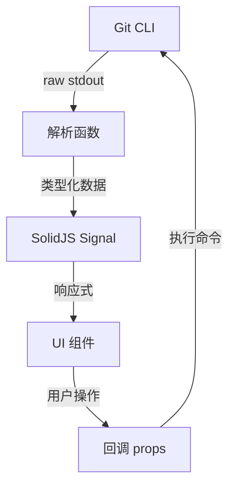

# 设计文档：Git 增强

## 概述

为 Git Explorer 组件新增三项功能：提交历史浏览器、Stash 管理、Split Diff 视图切换。设计遵循现有架构模式：纯函数解析 + SolidJS 响应式组件 + `useDiffComponent()` 渲染 diff。所有 Git 命令通过 SDK shell 执行，解析逻辑与 UI 完全分离以便测试。

## 架构

```
┌─────────────────────────────────────────────┐
│              GitExplorer (增强)               │
│  ┌─────────┬──────────────┬───────────────┐ │
│  │ Changes │ Commit Log   │ Stash         │ │
│  │ (现有)   │ (新增)        │ (新增)         │ │
│  └─────────┴──────────────┴───────────────┘ │
│                                              │
│  ┌──────────────────────────────────────────┐│
│  │ Diff Viewer (unified / split 切换)        ││
│  └──────────────────────────────────────────┘│
└─────────────────────────────────────────────┘
```

数据流：



## 组件与接口

### 1. 辅助函数扩展 (`git-explorer-helpers.ts`)

新增类型和解析函数，与现有 `parseStatus`、`parseBranches`、`parseDiff` 并列：

```ts
// 新增类型
export type CommitEntry = {
  hash: string
  author: string
  date: string
  message: string
}

export type StashEntry = {
  index: number
  branch: string
  message: string
}

// 新增解析函数
export function parseLog(raw: string): CommitEntry[]
export function parseStash(raw: string): StashEntry[]
```

`parseLog` 解析 `git log --format="%h%x00%an%x00%ar%x00%s" -n <count>` 的输出，使用 NUL 字符作为分隔符避免字段内容冲突。

`parseStash` 解析 `git stash list` 的标准输出格式 `stash@{N}: (WIP on|On) branch: message`。

### 2. GitExplorer 组件增强

现有 `GitExplorer` 组件新增 props：

```ts
export function GitExplorer(props: {
  // ... 现有 props 保持不变 ...

  // 新增：提交历史
  log?: CommitEntry[]
  onLoadLog?: (offset: number) => void
  onCommitClick?: (hash: string) => void
  commitDiff?: { hash: string; before: string; after: string }

  // 新增：Stash 管理
  stashes?: StashEntry[]
  onStashSave?: (message: string) => void
  onStashPop?: () => void
  onStashDrop?: (index: number) => void
  onLoadStashes?: () => void

  // 新增：Diff 视图切换
  diffStyle?: "unified" | "split"
  onDiffStyleChange?: (style: "unified" | "split") => void
})
```

组件内部使用 `Tabs` 组件（来自 `@opencode-ai/ui/tabs`）在三个视图间切换：
- "Changes"（现有功能）
- "Log"（提交历史）
- "Stash"（stash 管理）

### 3. CommitLog 子组件

内嵌在 `git-explorer.tsx` 中的列表组件：

```
┌──────────────────────────────┐
│ abc1234  John  2 hours ago   │
│ fix: resolve parsing bug     │
├──────────────────────────────┤
│ def5678  Jane  1 day ago     │
│ feat: add stash support      │
└──────────────────────────────┘
```

- 使用 `<For>` 渲染 `CommitEntry[]`
- 点击条目触发 `onCommitClick`
- 滚动到底部触发 `onLoadLog` 加载更多
- 选中的 commit diff 在右侧 Diff_Viewer 中展示

### 4. StashList 子组件

内嵌在 `git-explorer.tsx` 中的列表组件：

```
┌──────────────────────────────────┐
│ stash@{0}: On main: WIP feature │ [pop] [drop]
│ stash@{1}: On dev: save state   │ [drop]
└──────────────────────────────────┘
│ [Stash Save] 输入框 + 按钮       │
```

- 使用 `<For>` 渲染 `StashEntry[]`
- 顶部 stash 条目有 pop 和 drop 按钮
- 其余条目只有 drop 按钮
- 底部有 stash save 输入框和按钮

### 5. Diff 视图切换

在 diff 查看区域的标题栏添加 unified/split 切换按钮：

```
┌─ file.ts ──────────── [unified | split] ─ ✕ ─┐
│                                                │
│  diff content                                  │
│                                                │
└────────────────────────────────────────────────┘
```

- 使用 `diffStyle` prop 传递给 `<Dynamic component={diffComponent}>`
- 现有 `useDiffComponent()` 已支持 `diffStyle="split"` 属性
- 用 signal 存储当前选择，切换文件时保持

## 数据模型

### CommitEntry

| 字段 | 类型 | 说明 |
|------|------|------|
| hash | string | 缩写 commit hash（7-12 字符） |
| author | string | 提交作者名 |
| date | string | 相对时间（如 "2 hours ago"） |
| message | string | 提交信息首行 |

### StashEntry

| 字段 | 类型 | 说明 |
|------|------|------|
| index | number | stash 索引（0, 1, 2...） |
| branch | string | stash 时所在分支 |
| message | string | stash 描述信息 |

### GitState 扩展

现有 `GitState` 不变。提交历史和 stash 数据通过独立 props 传入，不混入 `GitState`，保持关注点分离。

</text>
</invoke>

## 正确性属性

*属性是在系统所有有效执行中都应成立的特征或行为——本质上是关于系统应该做什么的形式化陈述。属性是人类可读规范与机器可验证正确性保证之间的桥梁。*

本功能的核心可测试逻辑集中在解析函数上。UI 交互、命令执行、状态刷新等行为属于集成层，不适合属性测试。解析函数是纯函数，非常适合通过往返（round-trip）属性验证正确性。

为了支持往返测试，需要新增 `formatLog` 和 `formatStash` 函数，将类型化数据格式化回 git 命令的原始输出格式。

### Property 1: Commit Log 往返一致性

*For any* 有效的 `CommitEntry` 数组（hash 非空、author 非空、date 非空、message 非空且不含 NUL 字符），`parseLog(formatLog(entries))` SHALL 产生与原始数组等价的结果。

**Validates: Requirements 2.1, 2.5**

### Property 2: Stash List 往返一致性

*For any* 有效的 `StashEntry` 数组（index 为非负整数、branch 非空、message 非空），`parseStash(formatStash(entries))` SHALL 产生与原始数组等价的结果。此属性覆盖 `stash@{N}: WIP on branch: message` 和 `stash@{N}: On branch: message` 两种格式变体。

**Validates: Requirements 4.1, 4.3**

## 错误处理

所有 Git 命令执行错误统一通过现有 `gitError(op, err)` 函数处理，返回 `{ title, description }` 格式。各操作的 `op` 参数：

| 操作 | op 值 |
|------|-------|
| 加载提交历史 | `"log"` |
| 查看提交 diff | `"show"` |
| Stash save | `"stash save"` |
| Stash pop | `"stash pop"` |
| Stash drop | `"stash drop"` |
| 加载 stash 列表 | `"stash list"` |

空输入（空字符串）不视为错误，解析函数返回空数组。

## 测试策略

### 属性测试

使用 `fast-check` 库进行属性测试，配合 `bun:test`。

- 每个属性测试运行至少 100 次迭代
- 每个测试用注释标注对应的设计属性编号
- 标注格式：`Feature: git-enhancements, Property N: <property_text>`

生成器策略：
- `CommitEntry` 生成器：hash 为 7-12 位十六进制字符串，author 为非空字母字符串，date 为 `"N units ago"` 格式，message 为不含 NUL/换行的非空字符串
- `StashEntry` 生成器：index 为非负整数（0-99），branch 为非空字母字符串，message 为不含换行的非空字符串

### 单元测试

扩展现有 `git-explorer.test.ts`，新增：

- `parseLog`：空输入、单条记录、多条记录、特殊字符
- `parseStash`：空输入、"WIP on" 格式、"On" 格式、多条记录
- `formatLog`：验证输出格式正确
- `formatStash`：验证输出格式正确

### 测试互补性

- 单元测试覆盖具体示例和边界情况（空输入、特殊格式）
- 属性测试覆盖所有有效输入的通用正确性（往返一致性）
- 两者互补：单元测试捕获具体 bug，属性测试验证通用正确性
