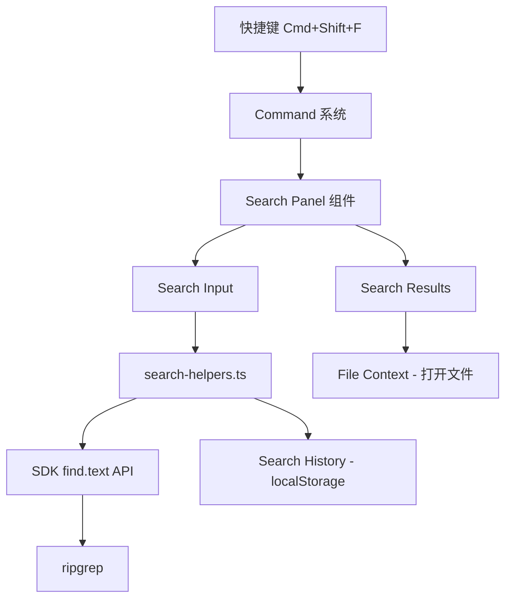

# 设计文档：全局搜索

## 概述

为 opencode 桌面应用新增跨文件全文搜索功能。利用 SDK 已有的 `find.text` API（底层 ripgrep）执行搜索，在 session 页面的侧面板中新增搜索标签页展示结果。搜索支持正则表达式、大小写敏感切换，结果按文件分组展示，点击可跳转到对应文件行。搜索历史通过 localStorage 持久化。

## 架构

全局搜索功能采用分层架构，与现有应用模式保持一致：



搜索功能的核心逻辑（结果分组、历史管理、查询构建）放在纯函数辅助模块 `search-helpers.ts` 中，UI 组件负责渲染和交互。这与现有的 `git-explorer-helpers.ts` / `git-explorer.tsx` 模式一致。

### 集成点

1. **命令系统**: 通过 `command.register` 在 session 页面注册 `search.global` 命令，绑定 `mod+shift+f` 快捷键
2. **侧面板**: 在 `SessionSidePanel` 的 tabs 系统中新增 `"search"` 标签页
3. **文件上下文**: 通过 `useFile` 的 `load` 和 `tab` 方法打开搜索结果对应的文件
4. **持久化**: 通过 `persisted` 工具函数将搜索历史存储到 localStorage

## 组件与接口

### 1. search-helpers.ts — 纯函数辅助模块

```typescript
// 将 SDK find.text 返回的扁平匹配数组按文件路径分组
function group(matches: SearchMatch[]): GroupedResult[]

// 构建传递给 SDK find.text 的搜索 pattern
// 当 regex=false 时，对特殊字符进行转义
function pattern(query: string, regex: boolean): string

// 转义正则特殊字符，将字面量文本转为安全的正则模式
function escape(text: string): string

// 截断结果：当匹配数超过 limit 时截断并标记
function truncate(groups: GroupedResult[], limit: number): { groups: GroupedResult[]; truncated: boolean; total: number }

// 生成搜索摘要文本（如 "5 个文件中的 23 个匹配"）
function summary(groups: GroupedResult[]): { files: number; matches: number }

// 管理搜索历史：添加、获取、导航
function addHistory(history: HistoryEntry[], entry: HistoryEntry, max: number): HistoryEntry[]
```

### 2. SearchPanel 组件

位于 `packages/app/src/components/search-panel.tsx`。

```typescript
function SearchPanel(props: {
  onOpenFile: (path: string, line: number) => void
}): JSX.Element
```

职责：
- 渲染搜索输入框（含正则/大小写切换按钮）
- 调用 SDK `find.text` 执行搜索（300ms 防抖）
- 使用 `search-helpers.ts` 的 `group` 函数处理结果
- 渲染按文件分组的搜索结果
- 管理搜索历史（上/下方向键导航）
- 取消前一次未完成的搜索

### 3. 命令注册

在 `use-session-commands.tsx` 中注册搜索命令：

```typescript
{
  id: "search.global",
  title: language.t("command.search.global"),
  category: language.t("command.category.search"),
  keybind: "mod+shift+f",
  onSelect: () => openSearchPanel(),
}
```

### 4. 侧面板集成

在 `session.tsx` 的 `Page` 组件中：
- 新增 `searchOpen` 信号控制搜索面板可见性
- 在 `SessionSidePanel` 中条件渲染 `SearchPanel`
- 搜索面板与现有的 review/file-tree 面板共享侧面板空间

## 数据模型

### SearchMatch（SDK 返回类型）

```typescript
// 来自 SDK FindTextResponses[200] 的单条匹配
type SearchMatch = {
  path: { text: string }
  lines: { text: string }
  line_number: number
  absolute_offset: number
  submatches: Array<{
    match: { text: string }
    start: number
    end: number
  }>
}
```

### GroupedResult

```typescript
type GroupedResult = {
  file: string        // 文件路径
  matches: SearchMatch[]  // 该文件下的所有匹配
}
```

### HistoryEntry

```typescript
type HistoryEntry = {
  query: string       // 搜索文本
  regex: boolean      // 是否正则模式
  caseSensitive: boolean  // 是否大小写敏感
}
```

### 组件状态

```typescript
// SearchPanel 内部状态
{
  query: string           // 当前搜索文本
  regex: boolean          // 正则模式开关
  caseSensitive: boolean  // 大小写敏感开关
  loading: boolean        // 搜索中状态
  error: string | undefined  // 错误信息
  results: GroupedResult[]   // 分组后的搜索结果
  truncated: boolean      // 结果是否被截断
  total: number           // 截断前的总匹配数
  collapsed: Record<string, boolean>  // 文件分组折叠状态
  historyIndex: number    // 历史导航索引，-1 表示当前输入
}
```

## 正确性属性

*属性（Property）是在系统所有有效执行中都应成立的特征或行为——本质上是关于系统应该做什么的形式化陈述。属性是人类可读规范与机器可验证正确性保证之间的桥梁。*

以下属性基于需求文档中的验收标准推导，每个属性都包含显式的"对于所有"量化语句，可直接用于 property-based testing。

### Property 1: 分组保留所有匹配且按文件聚合

*For any* 搜索匹配数组，`group` 函数返回的分组结果应满足：(a) 每个分组内所有匹配的文件路径相同且等于该分组的 `file` 字段，(b) 所有分组中匹配的总数等于输入数组的长度，(c) 不同分组的文件路径互不相同。

**Validates: Requirements 2.3, 3.1**

### Property 2: 摘要计数与分组数据一致

*For any* 分组结果数组，`summary` 函数返回的 `files` 应等于分组数量，`matches` 应等于所有分组中匹配数的总和。

**Validates: Requirements 3.2, 3.5**

### Property 3: 截断尊重上限

*For any* 分组结果数组和正整数 limit，`truncate` 函数返回的结果应满足：(a) 返回的匹配总数不超过 limit，(b) 当输入总匹配数超过 limit 时 `truncated` 为 true，(c) 当输入总匹配数不超过 limit 时返回的分组与输入相同且 `truncated` 为 false。

**Validates: Requirements 3.6**

### Property 4: 字面量模式转义的正确性（round-trip）

*For any* 包含正则特殊字符的字符串 s，`pattern(s, false)` 返回的正则表达式应精确匹配原始字符串 s 本身（即 `new RegExp(pattern(s, false)).test(s)` 为 true），且不应匹配仅由正则元字符语义产生的非字面量匹配。

**Validates: Requirements 5.2**

### Property 5: 正则模式透传

*For any* 字符串 s，`pattern(s, true)` 应返回与 s 完全相同的字符串。

**Validates: Requirements 5.3**

### Property 6: 历史记录添加保留新条目且尊重上限

*For any* 历史记录数组、新条目和正整数 max，`addHistory` 返回的结果应满足：(a) 结果的第一个元素等于新条目，(b) 结果长度不超过 max，(c) 如果新条目的 query 与已有条目重复，则去重后只保留最新的一条。

**Validates: Requirements 7.1, 7.2**

## 错误处理

| 场景 | 处理方式 |
|------|---------|
| SDK find.text 返回网络错误 | 显示错误提示，保留上次搜索结果 |
| SDK find.text 返回正则语法错误 | 在搜索输入框下方显示正则语法错误提示 |
| 搜索结果超过 1000 条 | 截断显示，提示用户缩小搜索范围 |
| 搜索输入为空 | 清空结果，不发起搜索请求 |
| 组件卸载时有进行中的搜索 | 通过 AbortController 取消请求 |
| localStorage 写入失败 | 静默失败，搜索历史仅在内存中保留 |

## 测试策略

### 双重测试方法

本功能采用单元测试 + 属性测试的双重策略：

- **单元测试**（bun:test）：验证具体示例、边界情况和错误条件
- **属性测试**（fast-check + bun:test）：验证所有输入上的通用属性

### 属性测试配置

- 库：`fast-check`（项目已有依赖）
- 每个属性测试最少运行 100 次迭代
- 每个测试用注释标注对应的设计文档属性
- 标注格式：`Feature: global-search, Property {number}: {property_text}`

### 测试文件

- `packages/app/src/components/search-helpers.test.ts` — 包含所有 `search-helpers.ts` 的单元测试和属性测试

### 单元测试覆盖

- `group`: 空数组、单文件多匹配、多文件混合
- `pattern`: 无特殊字符、含所有正则元字符、空字符串
- `escape`: 各种正则特殊字符
- `truncate`: 恰好等于 limit、超过 limit、少于 limit
- `summary`: 空分组、单分组、多分组
- `addHistory`: 空历史、满历史、重复条目

### 属性测试覆盖

对应设计文档中的 6 个正确性属性，每个属性一个 property-based test。
