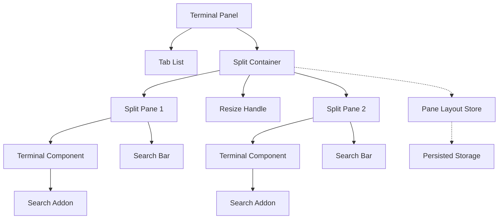

# 设计文档：终端增强

## 概述

本设计为 opencode 桌面应用的终端增加两项核心能力：终端内搜索和分屏终端。

终端内搜索通过自定义 Search Addon 实现终端缓冲区文本搜索，支持高亮、导航、大小写敏感、正则表达式和全词匹配。搜索栏以浮动 UI 形式覆盖在终端右上角。

分屏终端通过树形布局数据结构管理窗格的嵌套分割关系，每个窗格运行独立的终端实例。支持水平/垂直分屏、拖拽调整尺寸、键盘导航和布局持久化。

技术栈：SolidJS + Ghostty Web（xterm.js 兼容）+ Tauri 2，测试使用 bun:test + fast-check。

## 架构



核心架构决策：

1. 每个标签页拥有独立的分屏布局树，标签切换时保留各自的分屏状态
2. Search Addon 作为终端插件加载，直接操作终端缓冲区进行搜索和高亮
3. 分屏布局使用二叉树结构，叶节点为终端实例，内部节点为分割方向和比例
4. 搜索状态（开关、查询文本、选项）不持久化，每次打开终端时搜索栏默认关闭

## 组件与接口

### Search Addon（`packages/app/src/addons/search.ts`）

终端搜索插件，实现 `ITerminalAddon` 接口，负责在终端缓冲区中搜索文本并管理高亮装饰。

```typescript
type SearchOptions = {
  caseSensitive: boolean
  regex: boolean
  wholeWord: boolean
}

type SearchState = {
  query: string
  options: SearchOptions
  matches: SearchMatch[]
  current: number
}

type SearchMatch = {
  row: number
  col: number
  length: number
}

// 核心方法
class SearchAddon implements ITerminalAddon {
  activate(terminal: ITerminalCore): void
  dispose(): void
  search(query: string, options: SearchOptions): SearchState
  next(): SearchMatch | undefined
  previous(): SearchMatch | undefined
  clear(): void
}
```

搜索算法：
- 遍历终端缓冲区的每一行（包括 scrollback）
- 对每行文本执行字符串匹配或正则匹配
- 收集所有匹配项的行列位置和长度
- 通过终端装饰 API 高亮匹配项（当前匹配项使用不同颜色）
- 导航时滚动终端到目标匹配项所在行

### Search Bar（`packages/app/src/components/terminal-search.tsx`）

浮动搜索栏 SolidJS 组件，定位在终端内容区域右上角。

```typescript
type TerminalSearchProps = {
  addon: SearchAddon
  terminal: Term
  onClose: () => void
}
```

组件结构：
- 搜索输入框（带 debounce 150ms）
- 匹配计数显示（"N/M" 格式）
- 上一个/下一个导航按钮
- 大小写敏感/正则/全词匹配切换按钮
- 关闭按钮

### Split Container（`packages/app/src/components/terminal-split.tsx`）

分屏容器 SolidJS 组件，递归渲染分屏布局树。

```typescript
type SplitDirection = "horizontal" | "vertical"

type PaneNode = {
  type: "pane"
  id: string       // 对应 LocalPTY.id
  focused: boolean
}

type SplitNode = {
  type: "split"
  direction: SplitDirection
  ratio: number    // 0-1，第一个子节点占比
  children: [LayoutNode, LayoutNode]
}

type LayoutNode = PaneNode | SplitNode

// 核心操作函数（纯函数，便于测试）
function split(layout: LayoutNode, paneId: string, direction: SplitDirection, newPaneId: string): LayoutNode
function remove(layout: LayoutNode, paneId: string): LayoutNode | undefined
function resize(layout: LayoutNode, path: number[], ratio: number): LayoutNode
function focus(layout: LayoutNode, direction: "left" | "right" | "up" | "down", currentId: string): string | undefined
function find(layout: LayoutNode, paneId: string): PaneNode | undefined
function panes(layout: LayoutNode): string[]
```

布局操作说明：
- `split`: 将目标窗格替换为 SplitNode，原窗格和新窗格作为子节点，默认 50/50 比例
- `remove`: 移除目标窗格，如果父 SplitNode 只剩一个子节点则提升该子节点
- `resize`: 根据路径定位 SplitNode 并更新 ratio
- `focus`: 从当前窗格出发，按方向查找最近的相邻窗格
- `panes`: 收集布局树中所有叶节点的 pane ID

### Terminal Context 扩展（`packages/app/src/context/terminal.tsx`）

扩展现有 `LocalPTY` 类型和 terminal context，支持分屏布局：

```typescript
// 扩展 LocalPTY（保持向后兼容）
type LocalPTY = {
  id: string
  title: string
  titleNumber: number
  rows?: number
  cols?: number
  buffer?: string
  scrollY?: number
  cursor?: number
}

// 新增：每个标签页的分屏布局
// 存储在 persisted store 中，key 为 workspace terminal store
// 当 layout 为 undefined 时，表示单窗格模式（向后兼容）
type TerminalTabLayout = {
  layout?: LayoutNode
  focused?: string  // 当前聚焦的 pane ID
}
```

Context 新增方法：
- `split(id: string, direction: SplitDirection)`: 分屏当前标签页中的指定窗格
- `removeSplit(id: string)`: 关闭分屏窗格
- `focusPane(id: string)`: 聚焦指定窗格
- `focusDirection(direction: "left" | "right" | "up" | "down")`: 按方向切换焦点
- `resizePane(path: number[], ratio: number)`: 调整分屏比例
- `getLayout()`: 获取当前标签页的布局

### Terminal Panel 更新（`packages/app/src/pages/session/terminal-panel.tsx`）

更新终端面板以支持分屏渲染：
- 当标签页有分屏布局时，使用 Split Container 渲染
- 当标签页无分屏布局时，保持现有单终端渲染（向后兼容）
- 标签栏保持不变，每个标签页独立维护分屏状态

### Command 注册

新增命令和快捷键：

| 命令 ID | 描述 | 默认快捷键 |
|---------|------|-----------|
| `terminal.search` | 终端搜索 | `Cmd+F` / `Ctrl+F` |
| `terminal.splitRight` | 水平分屏 | `Cmd+\` / `Ctrl+\` |
| `terminal.splitDown` | 垂直分屏 | `Cmd+Shift+\` / `Ctrl+Shift+\` |
| `terminal.focusLeft` | 聚焦左侧窗格 | `Cmd+Alt+Left` / `Ctrl+Alt+Left` |
| `terminal.focusRight` | 聚焦右侧窗格 | `Cmd+Alt+Right` / `Ctrl+Alt+Right` |
| `terminal.focusUp` | 聚焦上方窗格 | `Cmd+Alt+Up` / `Ctrl+Alt+Up` |
| `terminal.focusDown` | 聚焦下方窗格 | `Cmd+Alt+Down` / `Ctrl+Alt+Down` |
| `terminal.closePane` | 关闭当前窗格 | — |

## 数据模型

### 分屏布局树

布局使用二叉树结构，支持任意深度嵌套：

```
单窗格（默认）:
{ type: "pane", id: "pty-1", focused: true }

水平分屏:
{
  type: "split",
  direction: "horizontal",
  ratio: 0.5,
  children: [
    { type: "pane", id: "pty-1", focused: true },
    { type: "pane", id: "pty-2", focused: false }
  ]
}

嵌套分屏（左侧水平分屏，右侧再垂直分屏）:
{
  type: "split",
  direction: "horizontal",
  ratio: 0.5,
  children: [
    { type: "pane", id: "pty-1", focused: false },
    {
      type: "split",
      direction: "vertical",
      ratio: 0.5,
      children: [
        { type: "pane", id: "pty-2", focused: true },
        { type: "pane", id: "pty-3", focused: false }
      ]
    }
  ]
}
```

### 搜索状态

搜索状态为组件级别，不持久化：

```typescript
type SearchState = {
  query: string
  options: SearchOptions
  matches: SearchMatch[]
  current: number  // 当前匹配项索引，-1 表示无匹配
}
```

### 持久化策略

- 分屏布局：持久化到现有的 workspace terminal store 中，新增 `layouts` 字段
- 搜索状态：不持久化
- 终端缓冲区：沿用现有持久化机制，每个分屏窗格的终端独立持久化


## 正确性属性

*属性（Property）是在系统所有有效执行中都应成立的特征或行为——本质上是关于系统应该做什么的形式化陈述。属性是人类可读规范与机器可验证正确性保证之间的桥梁。*

### Property 1: 搜索正确性 — 所有匹配项均被找到

*For any* 终端缓冲区文本和任意非空搜索查询，Search_Addon 返回的匹配项集合应等于在该文本中该查询的所有实际出现位置的集合。

**Validates: Requirements 2.1**

### Property 2: 搜索导航循环

*For any* 包含 N > 0 个匹配项的搜索状态，从索引 I 调用 next() 应将当前索引更新为 (I + 1) % N，调用 previous() 应将当前索引更新为 (I - 1 + N) % N。

**Validates: Requirements 2.3, 2.4, 2.5**

### Property 3: 搜索选项影响匹配结果

*For any* 包含大小写混合字符的缓冲区文本和纯小写查询，启用大小写敏感选项后的匹配数应小于或等于禁用时的匹配数。

**Validates: Requirements 3.4**

### Property 4: 分屏操作保持窗格数量不变量

*For any* 有效的布局树，对其中任意窗格执行 split() 操作后，新布局的窗格总数应等于原布局窗格总数加 1。对其中任意窗格执行 remove() 操作后（前提是窗格数 > 1），新布局的窗格总数应等于原布局窗格总数减 1。

**Validates: Requirements 4.1, 4.2, 4.4**

### Property 5: 分屏后原窗格仍存在

*For any* 有效的布局树和其中任意窗格 ID，执行 split() 操作后，原窗格 ID 和新窗格 ID 都应存在于新布局的窗格列表中。

**Validates: Requirements 4.1, 4.2**

### Property 6: 移除窗格后布局有效性

*For any* 包含 2 个以上窗格的布局树，移除任意一个窗格后，结果布局应仍然是有效的布局树（所有 SplitNode 恰好有两个子节点，所有叶节点为 PaneNode）。

**Validates: Requirements 4.4**

### Property 7: 调整比例范围约束

*For any* 包含 SplitNode 的布局树和任意有效路径，执行 resize() 后目标 SplitNode 的 ratio 应在 [0.1, 0.9] 范围内（防止窗格过小）。

**Validates: Requirements 5.2**

### Property 8: 布局序列化往返

*For any* 有效的布局树，将其序列化为 JSON 再反序列化应产生等价的布局树。

**Validates: Requirements 5.5**

### Property 9: 方向导航一致性

*For any* 包含多个窗格的布局树和其中任意窗格，如果从窗格 A 向右导航到达窗格 B，则从窗格 B 向左导航应返回窗格 A。

**Validates: Requirements 6.2**

## 错误处理

### 搜索错误

| 场景 | 处理方式 |
|------|---------|
| 无效正则表达式 | Search_Bar 显示错误提示，不执行搜索，保持上次有效结果 |
| 空搜索查询 | 清除所有高亮，显示 "0/0" |
| 终端缓冲区为空 | 返回空匹配列表，显示 "0/0" |

### 分屏错误

| 场景 | 处理方式 |
|------|---------|
| PTY 创建失败 | 显示 toast 错误提示，不创建分屏窗格 |
| 布局持久化数据损坏 | 回退到单窗格模式，丢弃损坏的布局数据 |
| WebSocket 连接失败 | 沿用现有重连机制（指数退避 1s-16s，最多 5 次） |
| 分屏窗格中终端退出 | 自动关闭该窗格，空间分配给相邻窗格 |

## 测试策略

### 双重测试方法

本功能采用单元测试和属性测试相结合的方式：

- **单元测试**：验证具体示例、边界情况和错误条件
- **属性测试**：验证跨所有输入的通用属性

### 属性测试配置

- 库：`fast-check`（已在项目中使用）
- 运行时：`bun:test`
- 每个属性测试最少运行 100 次迭代
- 每个属性测试必须通过注释引用设计文档中的属性编号
- 标签格式：`Feature: terminal-enhancements, Property N: {property_text}`

### 测试文件结构

| 文件 | 内容 |
|------|------|
| `packages/app/src/addons/search.test.ts` | Search Addon 的单元测试和属性测试 |
| `packages/app/src/components/terminal-split.test.ts` | 分屏布局纯函数的单元测试和属性测试 |

### 单元测试覆盖

- Search Addon：空查询、无匹配、单匹配、多匹配、正则语法错误
- 布局操作：单窗格分屏、嵌套分屏、移除最后窗格、移除中间窗格
- 导航：边界窗格导航（最左/最右/最上/最下）

### 属性测试覆盖

每个正确性属性（Property 1-9）对应一个独立的属性测试。属性测试使用 fast-check 生成随机输入：

- 搜索测试：生成随机缓冲区文本和搜索查询
- 布局测试：生成随机布局树（通过随机 split 操作序列构建）
- 导航测试：生成随机布局树和随机起始窗格

每个正确性属性必须由单个属性测试实现，不可拆分为多个测试。
